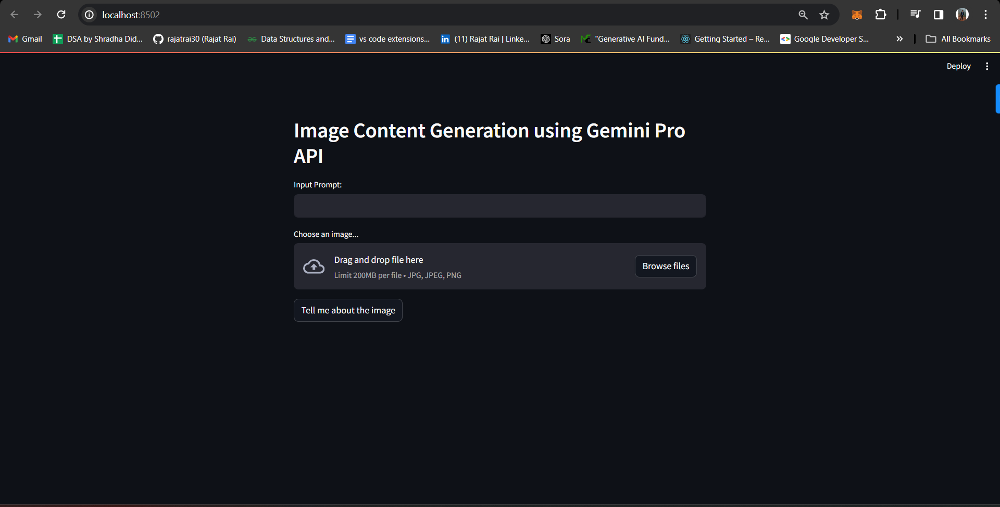

# Image-Content-Generation-using-GeminiPro-API

## About Repo
This repository contains the code for generating image content using the GeminiPro API. The GeminiPro API is a powerful tool that can be used to generate images based on the user's input. The code in this repository demonstrates how to use the GeminiPro API to generate images based on a user's input.

## Table of Contents: To be Updated Soon!!!
1. [Introduction](#introduction)
2. [Installation](#installation)
3. [Usage](#usage)
4. [Contributing](#contributing)
5. [License](#license)